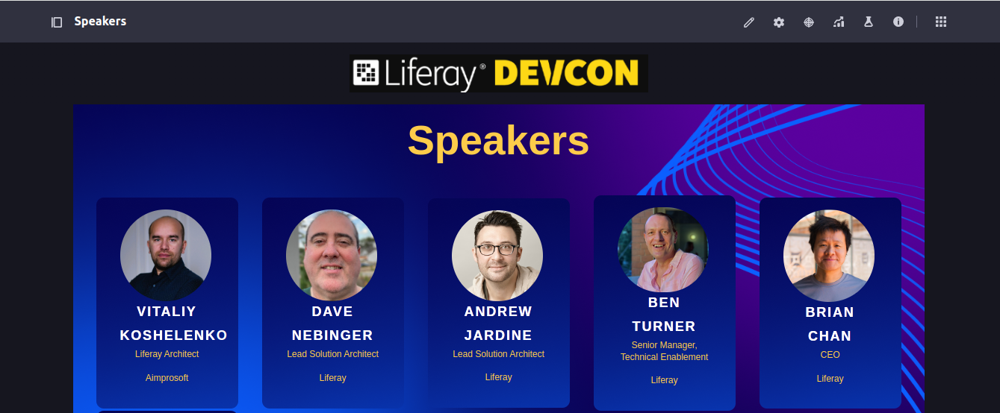

[Home](../../README.md)

# Site Initializers: Complete Example

1. Copy all content from [src](devcon-site-initializer/src) folder to [devcon-site-initializer](../../modules/devcon-site-initializer) module.

2. Deploy `devcon-site-intializer` module.

3. Enable Update Support for Site Initializer if not enabled yet (see [3. Update Support](../workshop/03-update-support/README.md)).

4. Create a new Site From `DevCon` Site Initializer.

5. Navigate to Publishing → Site Initializer and click Synchronize.

6. Check Home and Speaker pages:

