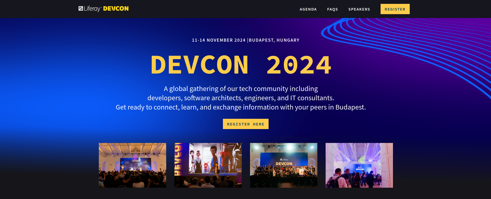
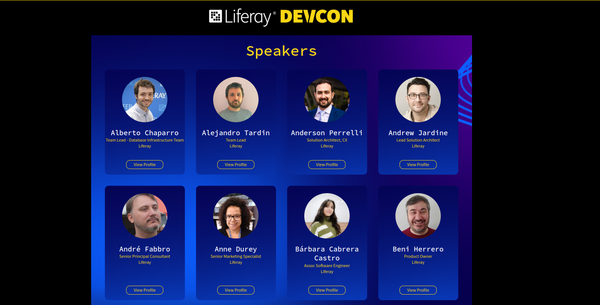

[Home](../../../README.md) / [Workshop](../README.md) 

# Introduction: Site Overview

In this workshop you'll incorporate into a Site Initializer a sample site based on Liferay DevCon 2024 website:
https://www.liferay.com/web/events/devcon-24

In scope of the workshop two pages are implemented:

1. Home Page:

2. Speakers Page:

As pages have different structure - two Master Pages should be implemented:
1. DevCon Main - for Home page
2. DevCon Secondary - for Speakers page

and integrated to Site Initializer.

Master pages use custom Fragments: DevCon Header (with two variations) and DevCon Footer.

Header and Footer have embedded Site Navigation with custom Widget Template and Navigation Menus.

Styling settings (brand colors, buttons, etc.) should be incorporated with a custom Style Book.  

The Home page should have the following sections:
1. Banner - a custom fragment with editable text fields
2. Gallery - a custom fragment with editable images
3. Venue - a custom fragment with editable image and text fields
4. Ticket Prices - a custom fragment with editable text fields
5. Sponsors - a custom fragment with a Collection Display displaying a Collection of Web Content Articles (of a custom Sponsor structure).

The Speakers page should have just one component:
1. Speakers - a custom fragment with a Collection Display displaying a Collection of Speaker Object Entries 

And now let's start the Site Initializer journey!

[1. Module Setup >>](../01-module-setup/README.md)

###### © Vitaliy Koshelenko 2024 | All rights reserved