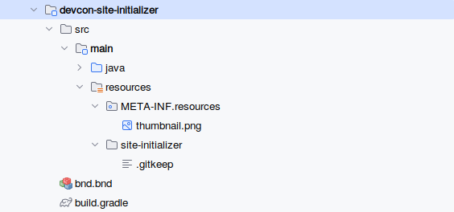
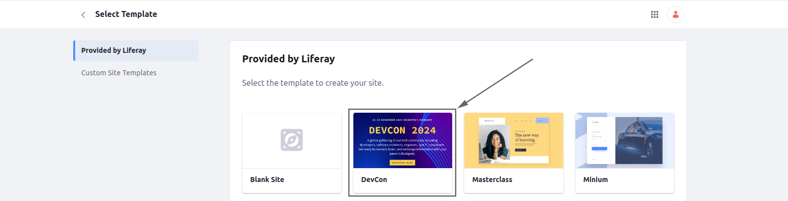
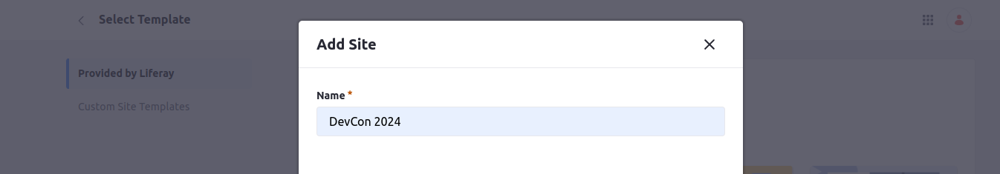

[Home](../../../README.md) / [Workshop](../README.md) 

# 1. Module Setup

## Goal 

Understand the anatomy of the Site Initializer OSGi module and required configuration.

## Overview

Site Initializers provide the possibility to define site content in special descriptors files following Content-as-Code approach.

Sites can be created from such Site Initializers in the same way as from Site Templates, and all the defined content should be created with together with site.

No custom code for content creation is needed, everything should be done internally by Liferay, with [BundleSiteInitializer](https://github.com/liferay/liferay-portal/blob/master/modules/apps/site-initializer/site-initializer-extender/site-initializer-extender/src/main/java/com/liferay/site/initializer/extender/internal/BundleSiteInitializer.java).

Site Initializer modules needs additional OSGi headers in `bnd.bnd`:

- `Provide-Capability: liferay.site.initializer` - to specify this is a Site Initializer module;
- `Liferay-Site-Initializer-Name: SiteInitialzerName` - to define the name for the Site Initializer. 

Content descriptors for Site Initializer should be defined inside [site-initializer](../../../modules/devcon-site-initializer/src/main/resources/site-initializer) folder.

## Practice

1. Navigate to [devcon-site-initializer](../../../modules/devcon-site-initializer) module. Analyze the module structure:

2. Check the [bnd.bnd](../../../modules/devcon-site-initializer/bnd.bnd) file:

        Bundle-Name: DevCon Site Initializer
        Bundle-SymbolicName: com.devcon.site.initializer
        Bundle-Version: 1.0.0
        Liferay-Site-Initializer-Name: DevCon
        Provide-Capability: liferay.site.initializer
        Web-ContextPath: /devcon-site-initializer

3. Deploy the module.

4. Navigate to Control Panel → Sites → New, and choose DevCon from the list of provided sites:

   5. Specify Site name, e.g. "DevCon 2024":
   
   and click the Add button.

A blank site should be created, considering there are no content descriptors for Site Initializer yet.

## References

[<< Introduction: Site Overview](../00-site-overview/README.md) | [2. Layout Set Configuration >>](../02-layout-set/README.md)

###### © Vitaliy Koshelenko 2024 | All rights reserved