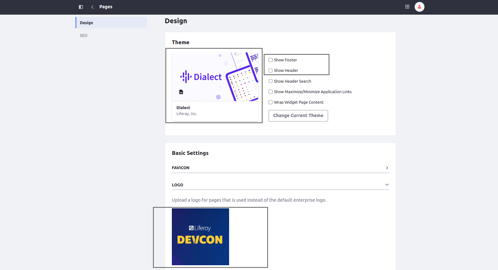

[Home](../../../README.md) / [Workshop](../README.md) 

# 2. Layout Set Configuration

## Goal 

Understand how to define LayoutSet configuration in Site Initializer module, hands-on practice.

## Overview

Layout Set is a set of Public or Private pages (by default - only Public, unless Private pages support is enabled) of the Site, 
where you can apply common settings for all the pages from the set.

Layout Set configuration is defined inside a `layout-set` subfolder of `site-initializer` folder, which may 
have `public` and `private` subfolders for public/private Layout Sets.

The `metadata.json` is a content descriptor for a LayoutSet, sample:

    {
      "settings": {
        "lfr-theme:regular:show-footer": false,
        "lfr-theme:regular:show-header": false,
        "lfr-theme:regular:show-header-search": false,
        "lfr-theme:regular:show-maximize-minimize-application-links": false,
        "lfr-theme:regular:wrap-widget-page-content": false
      },
      "themeName": "Dialect"
    }
        
It specifies the theme and theme settings for the LayoutSet.

Also, `logo.png` file may be included for LayoutSet logo, and `styles.css` for common styling. 

_Example in Liferay sources:_ https://github.com/liferay/liferay-portal/tree/master/modules/apps/site-initializer/site-initializer-masterclass/src/main/resources/site-initializer/layout-set/public

## Practice

1. Copy [layout-set](../../../exercises/exercise-02/layout-set) folder from `exercise-02` to [site-initializer](../../../modules/devcon-site-initializer/src/main/resources/site-initializer) folder.
2. Analyze the [metadata.json](../../../exercises/exercise-02/layout-set/public/metadata.json) file.

    _Here the Dialect theme is defined for a Layout Set, and also defined settings to disable the header and footer._

3. Re-deploy Site Initializer module.
4. Delete previously created site.
5. Create a new site from DevCon Site Initializer.
6. Navigate to Site Builder → Pages → Static Pages → Configuration:

7. Check the applied changes:

[<< 1. Module Setup](../01-module-setup/README.md) | [3. Update Support >>](../03-update-support/README.md)