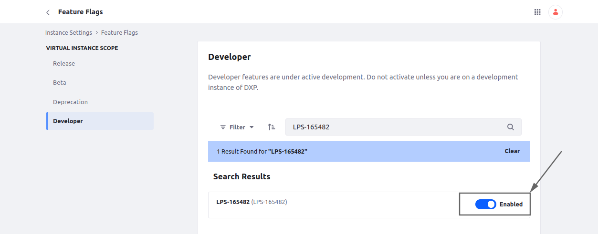
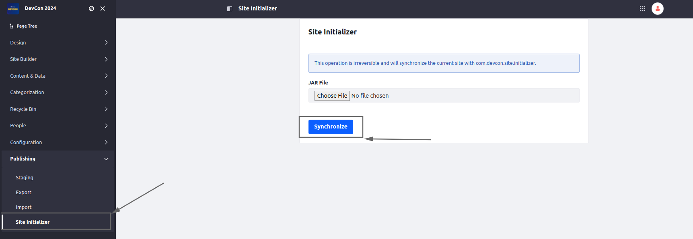

[Home](../../../README.md) / [Workshop](../README.md) 

# 3. Update Support

## Goal 

Understand how to enable Update Support for Site Initializer and synchronize the changes. 

## Overview

In a previous step to apply changes from the Site Initializer you had to recreate the site. 
This approach is time-consuming and may be not acceptable in certain scenarios.

Site Initializers have update support, but this feature is still under a feature flag and needs to be enabled.

Once updated support is enabled, the changes from a deployed Site Initializer bundle can be synchronized to the site(s) created from it.

_Related Jira tickets:_
- https://liferay.atlassian.net/browse/LPS-162000
- https://liferay.atlassian.net/browse/LPS-165482

_Blog link:_
- https://liferay.dev/blogs/-/blogs/site-initializers-update-support

## Practice

1. Navigate to Instance Settings → Feature Flags → Developer, and Search for LPS-165482. Enable the Feature Flag:

2. Delete previously created site.

    _**Note**: Update support is working only for sites created after enabling the feature flag_

3. Create a new site from DevCon Site Initializer.
4. Navigate to Site Menu → Publishing → Site Initializer, and see the new Site Initializer menu item. 

   Clicking the Synchronize button should apply the changes from a Site Initializer to the site.

[<< 2. Layout Set Configuration](../02-layout-set/README.md) | [4. Styling and Branding >>](../04-styling-branding/README.md)

###### © Vitaliy Koshelenko 2024 | All rights reserved