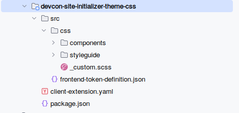
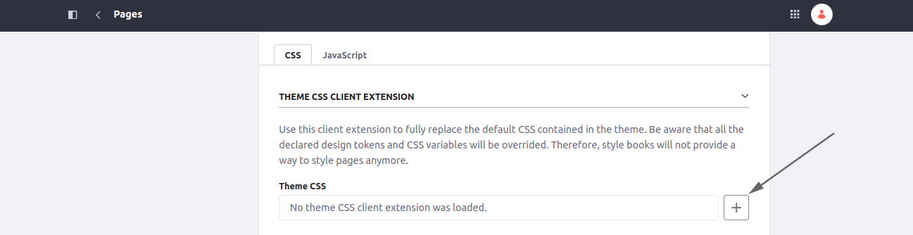
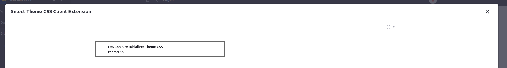

[Home](../../../README.md) / [Workshop](../README.md) 

# 4. Styling and Branding

## Goal 

Review different approaches for styling in Liferay, incorporate Theme CSS Client Extensions and Style Books. 

## Overview

Styling and branding is important for any site. 
Before proceeding with content and pages setup it's important to define the approach for styling:

|              Approach | Description                                                                                                                                                                  |
|----------------------:|------------------------------------------------------------------------------------------------------------------------------------------------------------------------------|
|          Custom Theme | An “old-school” approach, where you can define a custom theme with your own styling and layouts. Not recommended, and should be replaced with Client Extensions (CXs)        |
|          Custom CSS   | CSS is defined as part of LayoutSet configuration. Used by out-of-the-box Site Initializers. Good for small demos, but not a structured and reusable way for larger projects |
| **Client Extensions** | **Styling can be defined in an external Client Extension (globalCss / themeCSS), which can be applied to site pages or page templates**                                      |

The preferred approach for styling the portal is using Client Extensions.

With a [Theme CSS Client Extensions](https://learn.liferay.com/w/dxp/liferay-development/customizing-liferays-look-and-feel/using-a-theme-css-client-extension) you can define styling in the same way as with a regular theme, but the theme is not required anymore.

Also, you can define custom tokens for a Style Book in a `frontend-token-definition.json` file in the Theme CSS CX.

With this approach you may have a Client Extension with common styling, and multiple Site Initializer leveraging it to keep a consistent design across the portal.

## Practice

1. Navigate to [devcon-site-initializer-theme-css](../../../client-extensions/devcon-site-initializer-theme-css) folder:

   

2. Check the files within the module:
- [package.json](../../../client-extensions/devcon-site-initializer-theme-css/package.json) - Client Extension metadata and dependencies file;
- [client-extension.yaml](../../../client-extensions/devcon-site-initializer-theme-css/client-extension.yaml) - Client Extension configuration file:

        devcon-site-initializer-theme-css:
            clayURL: css/clay.css
            mainURL: css/main.css
            frontendTokenDefinitionJSON: src/frontend-token-definition.json
            name: DevCon Site Initializer Theme CSS
            type: themeCSS

   _**Note**: devcon-site-initializer-theme-css here is the reference of the Client Extension and will be used later on_

- [frontend-token-definition.json](../../../client-extensions/devcon-site-initializer-theme-css/src/frontend-token-definition.json) - file with custom tokens for Style Books;
- [_custom.scss](../../../client-extensions/devcon-site-initializer-theme-css/src/css/_custom.scss) - SCSS file for styleguide and common styling.

3. Deploy the Client Extension.

4. Navigate to Layout Set configuration (Site Builder → Pages → Static Pages → Configuration).

5. Click `+` button for `Theme CSS`:   

6. Select the `DevCon Site Initializer Theme CSS` Client Extension:

This way you have created a relation between the LayoutSet and the Client Extension to apply styling from the Client Extension for all the pages on a site.

[<< 3. Update Support](../03-update-support/README.md) | 