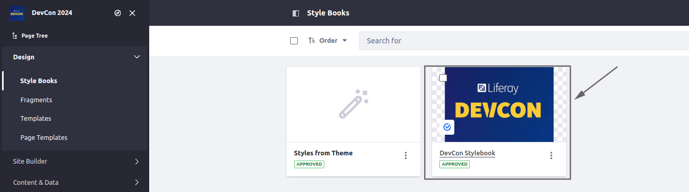

[Home](../../../README.md) / [Workshop](../README.md) 

# 5. Style Books

## Goal 

Incorporate custom Style Books to Site Initializer.

## Overview

[Style Books](https://learn.liferay.com/w/dxp/site-building/site-appearance/style-books) are important components for defining styling and branding. With a Style Book you can create a consistent custom design that can be applied across multiple pages on a portal, by customizing values for defined CSS tokens.

Style Books are applied for token definitions, based on a theme applied for a public LayoutSet of the Site.

For Style Books definition there are different approaches as well, based on the theme used:

|             Approach | Description                                                                                                                                           |
|---------------------:|-------------------------------------------------------------------------------------------------------------------------------------------------------|
|        Classic Theme | Has a "standard" set of tokens (e.g. 4 branding colors). Should be fine for most cases, but might be not enough for portals with more enhanced design |
|        Dialect Theme | Has an "extended" token set (e.g. 12 branding colors), which gives more configuration options and flexibility                                         |
| **Custom Token Set** | **A set of custom front-end tokens and CSS variables can be defined, exactly per project requirements**                                               |

Using a custom token set you can define your own tokens in `frontend-token-definition.json` and then define values for those tokens in Style Book.
This might be a good idea when building a site based on existing solution (like in our case), to reuse original colors / CSS variables. 

In the Site Initializer you can define your own Style Books in `style-books` folder.

The `style-book.json` file is a descriptor of Style Book and has the following structure:

    {
      "defaultStyleBookEntry": true,
      "frontendTokensValuesPath": "frontend-tokens-values.json",
      "name": "DevCon Stylebook",
      "thumbnailPath": "thumbnail.png"
    }

- `defaultStyleBookEntry` - identifies if the Style Books should be created as default style book;
- `frontendTokensValuesPath` - the path to a token values file;
- `name` - Style Book name;
- `thumbnailPath` - the path to a Style Book thumbnail.

The `frontend-tokens-values.json` file contains values for Style Book, for tokens defined in `frontend-token-definition.json`, sample:

    {
        "primaryStart": {
            "cssVariableMapping": "primaryStart",
            "value": "#FDCC4A"
        },
        "secondaryStart": {
            "cssVariableMapping": "secondaryStart",
            "value": "#60236B"
        }
    }

## Practice

1. Copy [style-books](../../../exercises/exercise-05/style-books) folder to [site-initializer](../../../modules/devcon-site-initializer/src/main/resources/site-initializer).

2. Deploy Site Initializer module.

3. Synchronize the changes: navigate to Site Menu → Publishing → Site Initializer and run the Synchronize button.

4. Navigate to Design → Style Books, the DevCon Stylebook should be created:

[<< 4. Styling and Branding](../04-styling-branding/README.md) | [6. Fragments >>](../06-fragments/README.md)

###### © [Vitaliy Koshelenko](https://www.linkedin.com/in/vitaliy-koshelenko) 2024 | All rights reserved