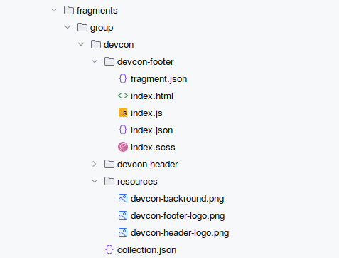
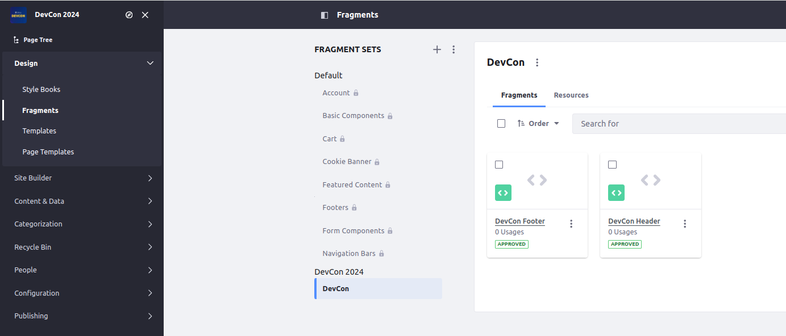

[Home](../../../README.md) / [Workshop](../README.md) 

# 6. Fragments

## Goal 

Learn how to define fragments for Site Initializer, prepare Header and Footer fragments for Master pages.

## Overview

[Fragments](https://learn.liferay.com/w/dxp/site-building/creating-pages/page-fragments-and-widgets/using-fragments) are main building blocks of a portal page.

When using the Master Templates approach the Header and Footer fragments are usually developed for the Master pages.

Fragments for Site Initializer are defined in `fragments` folder.

The [collection.json](../../../exercises/exercise-06/fragments/group/devcon/collection.json) file specifies the name and description for the Fragment Collection:

    {
       "description": "DevCon Fragments",
       "name": "DevCon"
    }

The `resources` folder contains fragment resources that are used in the fragments.

Each fragment is defined in a separate folder and has a descriptor file `fragment.json` along with the other fragment files, sample:

    {
        "configurationPath": "index.json",
        "cssPath": "index.css",
        "htmlPath": "index.html",
        "jsPath": "index.js",
        "name": "DevCon Header",
        "type": "component"
    }

## Practice

1. Copy [fragments](../../../exercises/exercise-06/fragments) folder from exercise-06 to [site-initializer](../../../modules/devcon-site-initializer/src/main/resources/site-initializer).

2. Analyze the folder structure and files:

    

3. Analyze fragments implementation.
    
    _**Note**: a DevCon Header fragment has two variations in configuration: primary and secondary, for DevCon Main and DevCon Secondary Master pages._ 

4. Redeploy the Site Initializer module and synchronize the changes.

5. Navigate to Site Menu → Design → Fragments. Make sure fragments are created:

    

[<< 5. Style Books](../05-style-books/README.md) | [7. Master Pages >>](../07-master-pages/README.md)