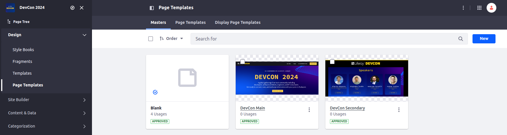

[Home](../../../README.md) / [Workshop](../README.md) 

# 7. Master Pages

## Goal 

Learn how to define Master Pages configuration in the Site Initializer.

## Overview

[Master Pages](https://learn.liferay.com/w/dxp/site-building/creating-pages/defining-headers-and-footers/master-page-templates) provide the possibility to define static content and editable areas on a portal page.

Using Master Pages you can define different site pages with the same template to have consistent design, and edit only customizable part - a DropZone.

In a Site Initializers Master Pages are defined inside `layout-page-templates / master-pages` directory.

For each Master Page a subdirectory should be created with three files:

1. `master-page.json` is a descriptor of the Master page, that specifies the Master Page name, sample:

        {
            "name": "DevCon Main"
        }
    _Note: this `name` is also used to generate Master Page key using the following approach: "DevCon Main" → "devcon-main"._

2. `page-definition.json` defines the structure of the Master Page and its settings.
    
    The structure should have one `DropZone` element along with other custom elements for the Master Page.
    In the settings you can specify:
    - Theme name using `themeName` property; 
    - Theme settings using `themeSettings` property; 
    - StyleBook configuration using `styleBook` property; 
    - Client Extensions configuration (e.g. using `themeCSSClientExtension` for Theme CSS Client Extension).

3. Optionally, with `thumbnail.png` you can define a preview image for the Master Page. 

## Practice

1. Copy [layout-page-templates](../../../exercises/exercise-07/layout-page-templates) folder to [site-initializer](../../../modules/devcon-site-initializer/src/main/resources/site-initializer).

2. Analyze the file structure:

   

3. Analyze the [page-definition.json](../../../exercises/exercise-07/layout-page-templates/master-pages/devcon-main/page-definition.json) file:

       {
         "pageElement": {
           "pageElements": [
             {
               "definition": {
                 "fragmentSettings": {
                   "unallowedFragments": []
                 }
               },
               "type": "DropZone"
             }
           ],
           "type": "Root"
         },
         "settings": {
           "styleBook": {
             "key": "devcon",
             "name": "DevCon Stylebook"
           },
           "themeCSSClientExtension": {
             "externalReferenceCode": "LXC:devcon-site-initializer-theme-css",
             "name": "DevCon Site Initializer Theme CSS"
           },
           "themeName": "Dialect",
           "themeSettings": {
             "lfr-theme:regular:show-header-search": "false",
             "lfr-theme:regular:show-header": "false",
             "lfr-theme:regular:show-footer": "false",
             "lfr-theme:regular:wrap-widget-page-content": "false"
           }
         },
         "version": 1.1
       }

    _**Note**: Theme CSS Client Extension is referenced by Client Extension ID defined in [client-extension.yaml](../../../client-extensions/devcon-site-initializer-theme-css/client-extension.yaml), using format `LCX:CX-ID`._

4. Redeploy the Site Initializer module and synchronize the changes.

5. Navigate to Site Menu → Design → Page Templates → Masters. Make sure Master Pages are created:

[<< 6. Fragments](../06-fragments/README.md) | [8. Master Pages Content >> ](../08-master-pages-content/README.md)

###### © Vitaliy Koshelenko 2024 | All rights reserved