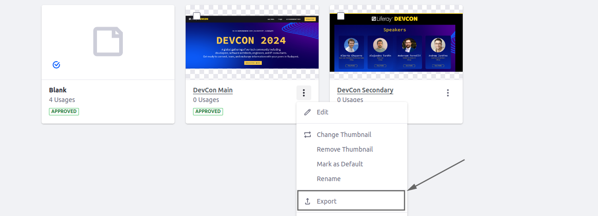

[Home](../../../README.md) / [Workshop](../README.md) 

# 8. Master Pages Content

## Goal 

Learn how to define content for Master Pages, hands-on practice on preparing content descriptors.

## Context

In the context of this Workshop Demo you need to define content for two Master Templates: DevCon Main and DevCon Secondary.

A DevCon Main template should contain:
- Header: a DevCon Header fragment with primary configuration variation;
- Content: a DevCon Page Wrapper fragment with Master Page DropZone inside;
- Footer: a DevCon Footer fragment with DevCon Social Media fragment added to DropZone.

A DevCon Secondary template should contain:
- Header: a DevCon Header fragment with secondary configuration variation;
- Content: a Master Page DropZone.

## Overview

Content for Master Pages is defined in a `page-definition.json`.  In a previous task you defined the basic content descriptor: with DropZone only, and required configuration.

To define additional elements the root `pageElements` array inside the `page-definition.json` needs to be adjusted:

The JSON structure required for page definition is quite complex to be defined manually. Thus, usually a Master Page is created manually for the first time, and then exported and incorporated into Site Initializer.

The exported JSON needs to be adjusted to make sure it does not contain any environment-specific or site-specific data (IDs, Site URL or Site Key, etc.). Site Initializer supports special placeholders for such cases. 

_Example in Liferay sources:_ https://github.com/liferay/liferay-portal/blob/master/modules/apps/site-initializer/site-initializer-masterclass/src/main/resources/site-initializer/layout-page-templates/master-pages/main-1/page-definition.json

## Practice

### 1. Define Additional Fragments

1.1. Copy [devcon-page-wrapper](../../../exercises/exercise-08/fragments/group/devcon/devcon-page-wrapper) and [devcon-social-media](../../../exercises/exercise-08/fragments/group/devcon/devcon-social-media) fragments from `exercise-08` to Site Initializer module.

1.2. Redeploy Site Initializer module and run Synchronization.

1.3. Make sure new fragments created.

### 2. Setup Master Pages 

#### DevCon Main Master Page 

1. Navigate to Site Menu → Design → Page Templates → Masters.
2. Click on `DevCon Main` to edit the Master Page:

    

3. Add `DevCon Header`, `DevCon Page Wrapper` and `DevCon Footer` fragments.
4. Move `Drop Zone` inside the `DevCon Page Wrapper`.
5. Add `DevCon Social Media` inside footer's DropZone.
   
   

6. Publish the Master Page.

#### DevCon Secondary Master Page

1. Navigate to Site Menu → Design → Page Templates → Masters.
2. Click on `DevCon Secondary` to edit the Master Page.
3. Add `DevCon Header` fragment.
4. Choose `Secondary` type in fragment configuration.

   

5. Publish the Master Page.

### 3. Define Master Pages Content Descriptors

1. Navigate to Site Menu → Design → Page Templates → Masters.
2. Click on DevCon Main → Actions → Export:

   

3. Open the `page-definition.json` file inside the downloaded zip:

   

4. Copy JSON from `page-definition.json` to a temporary json file, and format it.
5. Adjust the JSON definition in a following way:
- Remove generated `id` elements, e.g. `"id": "9c456897-d60c-6835-e8fe-163e2cc6b74d",`;
- Replace hard-coded `siteKey` value with `[$GROUP_KEY$]` placeholder;
- Replace hard-coded Site URL with `[$GROUP_FRIENDLY_URL$]` placeholder.
  
- Eliminate `widgetInstances` section for navigation menus:
  

  _**Note**: this is required for navigation configuration export later on.

6. Update `page-definition.json` content for DevCon Main using the resulting JSON. 
7. Repeat the same steps for DevCon Secondary Master Page.

   _**Note**: you can also use already prepared files from [exercise-08](../../../exercises/exercise-08)_ 

8. Redeploy Site Initializer module and run Synchronization.
9. Check Master Pages, make sure they remain the same after applying changes from Site Initializer.

[<< 7. Master Pages](../07-master-pages/README.md) | [9. Pages Definition >>](../09-layouts/README.md)