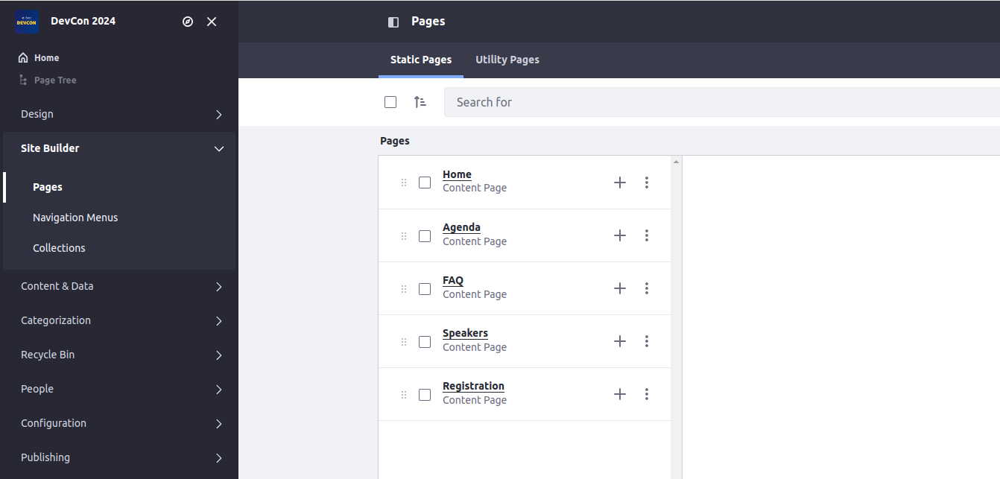
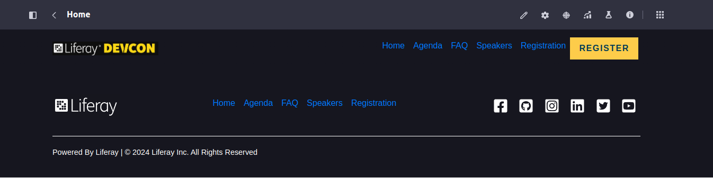

[Home](../../../README.md) / [Workshop](../README.md) 

# 9. Pages Definition

## Goal 

Learn how to define pages (Layouts) in the Site Initializer.

## Overview

Pages in a Site Initializer are defined inside `layouts` directory. 

For each page an individual folder must be created. For child pages child folders must be defined as well.

Pages are created in the same order as folders (sorted alphabetically), that's why numeric prefixes can be specified for folder names to achieve required ordering.

Each page folder should contain two files:
- `page.json` - a page descriptor, where you can specify page name, URL and other settings, sample:

      {
         "friendlyURL": "/home",
         "hidden": false,
         "name_i18n": {
            "en_US": "Home"
         },
         "private": false,
         "system": false,
         "type": "Content"
      }

- `page-definition.json` - a descriptor of page structure and configuration, similar to Master Pages.

    Example of minimal page definition: 

      {
         "pageElement": {
            "pageElements": [],
            "type": "Root"
         },
         "settings": {
            "masterPage": {
               "key": "devcon-main"
            }
         }
      }

_Example in Liferay sources:_ https://github.com/liferay/liferay-portal/tree/master/modules/apps/site-initializer/site-initializer-masterclass/src/main/resources/site-initializer/layouts

## Context

In the context of this Workshop Demo you need to define the following Pages:
1. Home
2. Agenda
3. FAQ
4. Speakers
5. Registration

The Home and Speakers ones will be used for content setup later on, other ones - just for displaying in navigation menus. 

## Practice

1. Copy [layouts](../../../exercises/exercise-09/layouts) from exercise-09 to [site-initializer](../../../modules/devcon-site-initializer/src/main/resources/site-initializer).
2. Analyze page definitions.
2. Redeploy Site Initializer module and run Synchronization.
3. Make sure Pages created successfully:

  

  

[<< 8. Master Pages Content](../08-master-pages-content/README.md) | 