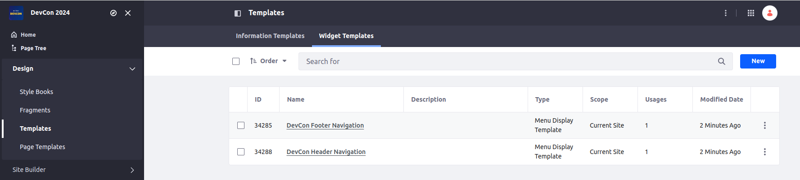

[Home](../../../README.md) / [Workshop](../README.md) 

# 10. Widget Templates

## Goal 

Learn how to define Widget Templates in a Site Initializer module.

## Context

In the context of this Workshop Demo you need to define Widget Templates for Site Navigation Menu widget in order to define custom structure and styling for header/footer navigation.

## Overview

Widget Templates are used to customize the layout of out-of-the-box widgets having such capability.

Using Widget Templates for Site Navigation Menu you can customize how the site menus (e.g. header and footer navigation) are rendered.

Widget Templates in the Site Initializer are defined inside `ddm-templates` folder. For each Widget Template a subfolder must be created.

The subfolder should contain two files:
- `ddm-template.ftl` - a template file, sample:

        <#if entries?has_content>
            <div class="devcon-nav devcon-nav--footer">
                <#list entries as navItem>
                    <#assign nav_item_css_class = "devcon-nav__link" />
                    <#if navItem.isSelected()>
                        <#assign nav_item_css_class = "${nav_item_css_class} selected active" />
                    </#if>
                    <a href="${navItem.getURL()}" class="${nav_item_css_class}">
                        ${navItem.getName()}
                    </a>
                </#list>
            </div>
        </#if>

- `ddm-template.json` - a widget template descriptor, having the following structure:

      {
        "className": "com.liferay.portal.kernel.theme.NavItem",
        "ddmTemplateKey": "DEVCON_FOOTER_NAV",
        "name": "DevCon Footer Navigation",
        "resourceClassName": "com.liferay.portlet.display.template.PortletDisplayTemplate"
      }

  _**Note**: Here a widget template for Site Navigation portlet with `DEVCON_FOOTER_NAV` DDM Template Key is defined._

_Example in Liferay sources:_ https://github.com/liferay/liferay-portal/tree/master/workspaces/liferay-marketplace-workspace/client-extensions/liferay-marketplace-site-initializer/site-initializer/ddm-templates/navigation-header

## Practice

1. Copy [ddm-templates](../../../exercises/exercise-10/ddm-templates) folder from `exercise-10` to [site-initializer](../../../modules/devcon-site-initializer/src/main/resources/site-initializer).
2. Analyze widget templates definition (`ddm-template.json`) and template (`ddm-template.ftl`) files.
3. Redeploy Site Initializer module and run Synchronization.
4. Navigate to Site Menu → Design → Templates → Widget Templates. Make sure `DevCon Header Navigation` and `DevCon Footer Navigation` templates created:

  

5. Navigate to Site Menu → Design → Page Templates → Masters and edit `DevCon Main` Master Page.
6. Navigate to header navigation configuration:
  
  
  
7. Choose `DevCon Header Navigation` display template and save configuration:

    

8. Select `DevCon Footer Navigation` for footer navigation in the same way:

   
   _**Note**: styling for navigation is applied from the Theme CSS Client Extension deployed previously._

9. Publish `DevCon Main` Master Page end export its definition.

10. Find `widgetInstances` sections in the exported JSON, e.g.:

    ``` 
        "widgetInstances": [
           {
             "widgetConfig": {
               "siteNavigationMenuId": "0",
               "displayStyle": "ddmTemplate_DEVCON_HEADER_NAV",
               "displayDepth": "0",
               "displayStyleGroupKey": "DevCon 2024",
               "siteNavigationMenuType": "-1",
               "rootMenuItemType": "absolute",
               "expandedLevels": "auto",
               "rootMenuItemLevel": "0",
               "displayStyleGroupId": "35968"
             },
             "widgetName": "com_liferay_site_navigation_menu_web_portlet_SiteNavigationMenuPortlet"
           }
         ]
    ```

9. Replace values for `displayStyleGroupKey` and `displayStyleGroupId` with placeholders: `[$GROUP_KEY$]` / `[$GROUP_ID$]`.
10. Update `widgetInstances` sections in `page-definition.json` for Master Page with the value above, [see](https://github.com/vitaliy-koshelenko/devcon-site-initializers/commit/0ce4f764ca5aeb0700107fc354bbb0262f859b24).
  
    _**Note**: you can use updated [page-definition.json](../../../exercises/exercise-10/layout-page-templates/master-pages/devcon-main/page-definition.json) from `exercise-10`._

12. Redeploy Site Initializer module and recreate the site. Make sure widget templates are applied:

    
    _**Note:** some changes like this might not be propagated with Synchronize feature, in such cases site recreation might be needed._

[<< 9. Pages Definition](../09-layouts/README.md) | [11. Navigation Menus >>](../11-navigation-menus/README.md)