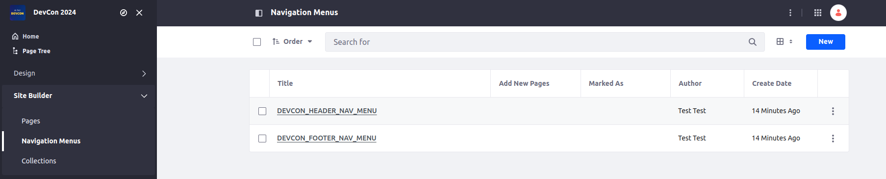
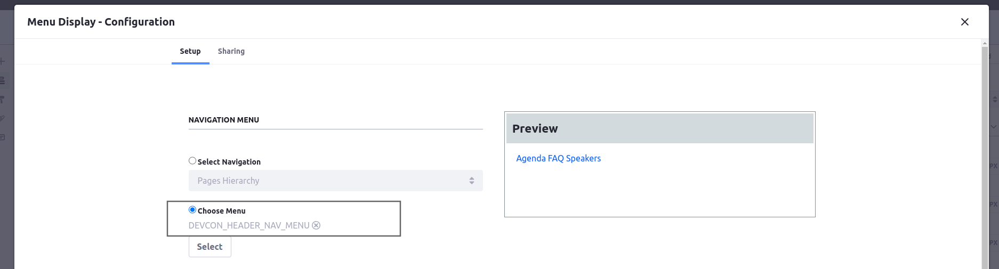
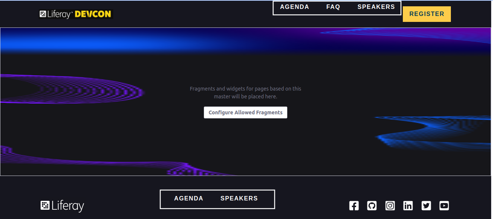

[Home](../../../README.md) / [Workshop](../README.md) 

# 11. Navigation Menus

## Goal 

Learn how to define Site Navigation Menus in Site Initializer and apply them for Site Navigation Menu widgets.

## Context

In the context of this Workshop Demo you need to define custom navigation menus for Header and Footer, and apply them for appropriate Site Navigation Menu widgets.

## Overview

With Navigation Menus you can define custom menus for a site, and specify which elements are included into navigation and how they are organized.

Navigation menus in the Site Initializer are defined in a `site-navigation-menus.json` descriptor file. Here you can define the navigation menus and menu items for each of the menus, sample:

```json
[
	{
		"menuItems": [
			{
				"friendlyURL": "/agenda",
				"externalReferenceCode": "devcon-header-agenda",
				"privateLayout": false,
				"type": "layout"
			},
			{
				"friendlyURL": "/faq",
				"externalReferenceCode": "devcon-header-faq",
				"privateLayout": false,
				"type": "layout"
			},
			{
				"friendlyURL": "/speakers",
				"externalReferenceCode": "devcon-header-speakers",
				"privateLayout": false,
				"type": "layout"
			}
		],
		"name": "DEVCON_HEADER_NAV_MENU"
	},
	{
		"menuItems": [
			{
				"friendlyURL": "/agenda",
				"externalReferenceCode": "devcon-footer-agenda",
				"privateLayout": false,
				"type": "layout"
			},
			{
				"friendlyURL": "/speakers",
				"externalReferenceCode": "devcon-footer-speakers",
				"privateLayout": false,
				"type": "layout"
			}
		],
		"name": "DEVCON_FOOTER_NAV_MENU"
	}
]
```

In the example above two navigation menus are created: `DEVCON_HEADER_NAV_MENU` and `DEVCON_FOOTER_NAV_MENU`. For each of the menus menu items are defined, using the following properties:
- `type`: the type of the navigation menu item;
    
    _**Note**: here we use only `layout` types, but there are other supported types as well, e.g. `node`, `url`, `display-page`._

- `friendlyURL`: the friendly URL of the referenced Layout;
- `privateLayout`: a flag indicating if menu item should be privately restricted;
- `externalReferenceCode`: unique menu item code.

  _**Note**: It's required to specify `externalReferenceCode` to avoid menu items duplication on synchronization._

_Example in Liferay sources:_ https://github.com/liferay/liferay-portal/blob/master/modules/apps/site-initializer/site-initializer-masterclass/src/main/resources/site-initializer/site-navigation-menus.json

## Practice

1. Copy [site-navigation-menus.json](../../../exercises/exercise-11/site-navigation-menus.json) from `exercise-11` to [site-initializer](../../../modules/devcon-site-initializer/src/main/resources/site-initializer) folder.
2. Analyze the JSON structure. 
3. Redeploy Site Initializer module and run Synchronization.
4. Navigate to Site Menu → Site Builder → Navigation Menus. Make sure `DEVCON_HEADER_NAV_MENU` and `DEVCON_FOOTER_NAV_MENU` navigation menus created:

  

5. Navigate to Site Menu → Design → Page Templates → Masters and edit `DevCon Main` Master Page.
6. For the header menu select `DEVCON_HEADER_NAV_MENU` Navigation Menu in configuration:

  

7. Select `DEVCON_FOOTER_NAV_MENU` navigation menu for footer menu. Now only those menu items defined in navigation menus should be displayed:

  

8. Publish `DevCon Main` Master Page end export its definition. Navigate to `widgetInstances` section. An additional configuration property `siteNavigationMenuId` should be added to specifies the Site Navigation Menu for the navigation widget: 

```json
{
  "widgetConfig": {
    "siteNavigationMenuId": "37810",
    "displayStyle": "ddmTemplate_DEVCON_HEADER_NAV",
    "displayDepth": "0",
    "displayStyleGroupKey": "DevCon 2024",
    "siteNavigationMenuType": "-1",
    "rootMenuItemType": "absolute",
    "expandedLevels": "auto",
    "rootMenuItemLevel": "0",
    "displayStyleGroupId": "37627"
  },
  "widgetName": "com_liferay_site_navigation_menu_web_portlet_SiteNavigationMenuPortlet"
}
```

But the problem here is missing placeholder for it. Even in Liferay sources in some places it's [hard-coded](https://github.com/liferay/liferay-portal/blob/master/modules/apps/site-initializer/site-initializer-raylife-d2c/src/main/resources/site-initializer/layout-page-templates/master-pages/public-quote/page-definition.json#L37), in other ones - a hack with fragment configuration is used. 

In the next chapter you'll see how you can customize the site initializing process to workaround issues like this.

[10. Widget Templates](../10-widget-templates/README.md) | [12. Customization](../12-customization/README.md)

###### © [Vitaliy Koshelenko](https://www.linkedin.com/in/vitaliy-koshelenko) 2024 | All rights reserved