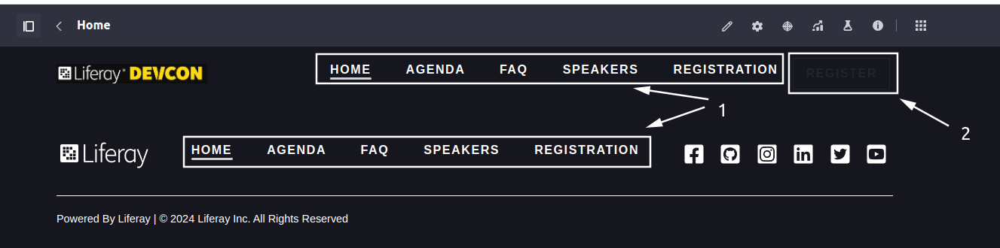
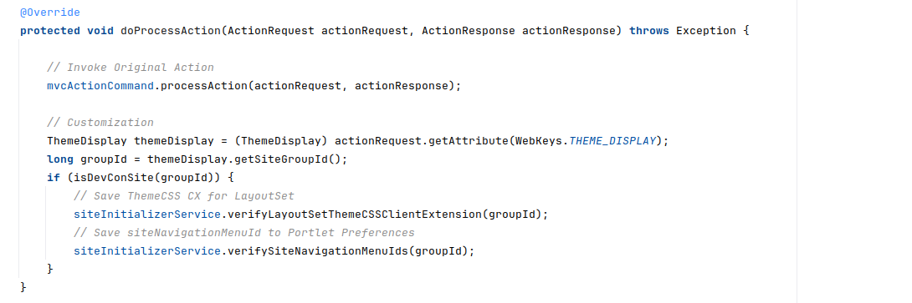

[Home](../../../README.md) / [Workshop](../README.md) 

# 12. Customization

## Goal 

Learn how you can customize the site initialization process in order to workaround missing functionality and introduce the custom initialization logic.

## Overview

Even though Liferay provides a bunch of various extension points to inject custom functionality, if you look at [BundleSiteInitializer](https://github.com/liferay/liferay-portal/blob/master/modules/apps/site-initializer/site-initializer-extender/site-initializer-extender/src/main/java/com/liferay/site/initializer/extender/internal/BundleSiteInitializer.java), the heart of Site Initializer, you'll see that it's not designed to be extendable at all: a monolith non-OSGi class located in an internal package.

However, if you use [Update Support](../03-update-support/README.md) - you can customize the Synchronize process by overriding an appropriate MVCCommand, and introducing custom logic before/after Site Initializer synchronization is run:

```java
@Component(
        property = {
                "service.ranking:Integer=100",
                "javax.portlet.name=com_liferay_site_initializer_extender_web_SiteInitializerPortlet",
                "mvc.command.name=/site_initializer/synchronize_site_initializer"
        },
        service = MVCActionCommand.class
)
public class SynchronizeSiteInitializerMVCActionCommandOverride extends BaseMVCActionCommand {

    @Override
    protected void doProcessAction(ActionRequest actionRequest, ActionResponse actionResponse) throws Exception {

        // On-Before Customization 
        
        // Invoke Original Action for Site Initializer Synchronization
        mvcActionCommand.processAction(actionRequest, actionResponse);

        // On-After Customization 
    }

    @Reference(target = "(component.name=com.liferay.site.initializer.extender.web.internal.portlet.action.SynchronizeSiteInitializerMVCActionCommand)")
    private MVCActionCommand mvcActionCommand;
}
```

## Practice

1. Create a new site from `DevCon` Site Initializer, and navigate to site pages.
2. You'll see two issues:

   
    1) Site Navigation Menus are not applied (due to a problem described in a previous chapter).
    2) Styling is not following the Style Book definition. This happens, because Theme CSS Client Extension is not applied to Layout Set, due to lack of such configuration.

3. Copy [java](../../../exercises/exercise-12/src/main/java) classes from `exercise-12` to [java](../../../modules/devcon-site-initializer/src/main/java) folder in Site Initializer module.
4. Analyze Java code for Site Initializer customization.

   
   Here `siteNavigationMenuId` is set to portlet preferences, and also LayoutSet is linked with a Theme CSS Client Extension for correct Style Book configuration. 

5. Re-deploy Site Initializer module.
6. Create a new site from `DevCon` Site Initializer. The issues mentioned in `2.` should still be there.
7. Run `Synchronize` action. The issues should be fixed due to customization applied.

[<< 11. Navigation Menus](../11-navigation-menus/README.md) | 