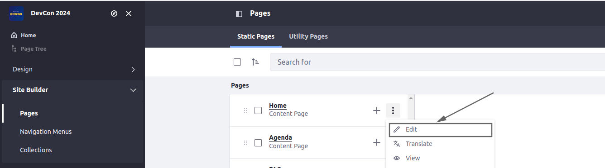
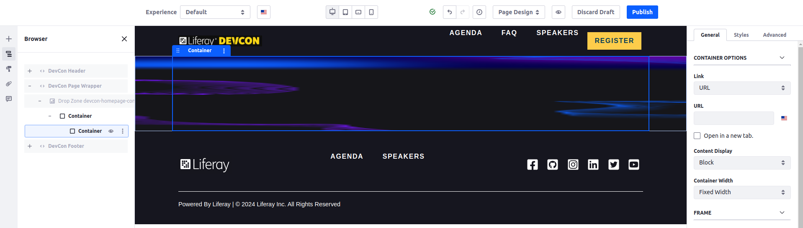
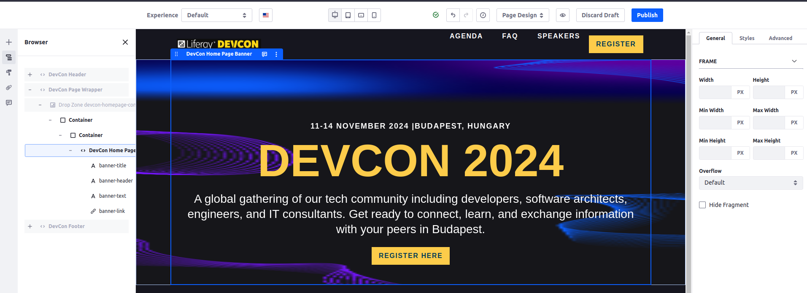
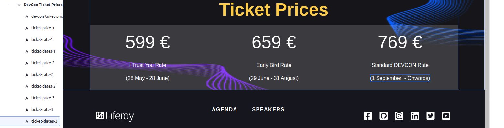
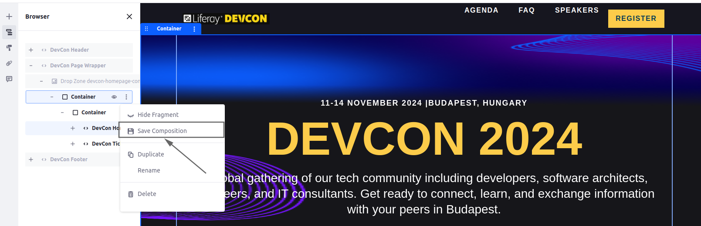
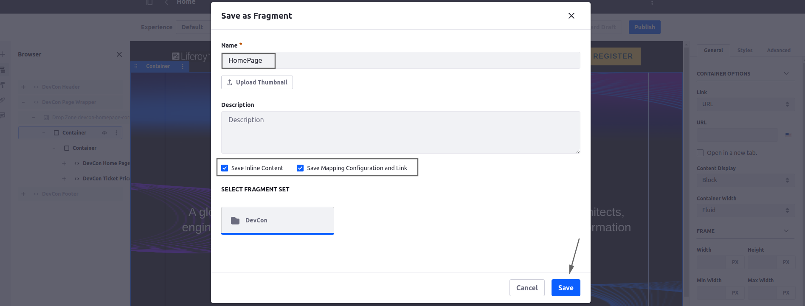
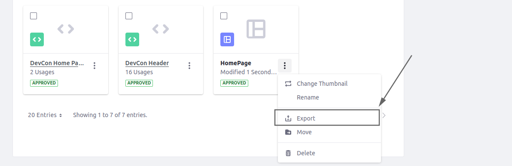
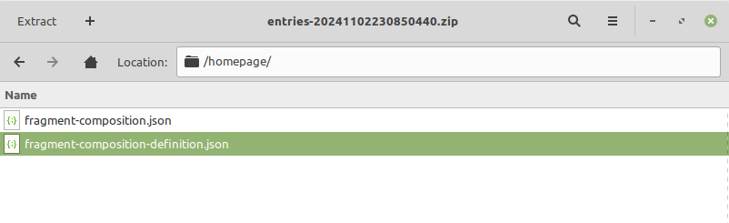
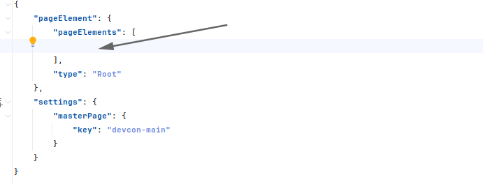

[Home](../../../README.md) / [Workshop](../README.md) 

# 13. Page Content

## Goal 

Learn how you can define content for site pages in Site Initializer, hands-on practice on preparing content descriptors.

## Context

In the context of this Workshop Demo you'll need to define content in Site Initializer for Liferay DevCon 2024 site: Home page and Speakers page.

The home page should display custom fragments (Banner, Gallery, Venue, Ticket Prices, Sponsors), while the Speaker page should display a Collection of Objects.

## Overview

Similar to Master Pages, content for Pages (Layouts) is defined in `page-definition.json` descriptor file.

For Master Pages you can use the export feature, while it’s missing for individual pages. But to export the JSON structure for a page you can use the Fragment Composition feature.

The JSON for page definition should be cleaned up from environment-specific data, such values should be replaced with special placeholders.

## Practice

### 1. Additional Fragments Definition

1.1. Copy [devcon-homepage-banner](../../../exercises/exercise-13/fragments/group/devcon/devcon-homepage-banner) and [devcon-ticket-prices](../../../exercises/exercise-13/fragments/group/devcon/devcon-ticket-prices) fragments from `exercise-13` to Site Initializer module.

1.2. Redeploy Site Initializer module and run Synchronization.

1.3. Make sure new fragments created.

### 2. Content Setup

2.1. Navigate to Site Builder → Pages and edit the Home page:

2.2. Add a wrapping container and an inner fixed-width container:

2.3. Add `DevCon Home Page Banner` fragment to the inner container:

2.4. Add `DevCon Ticket Prices` fragment below, and specify values for the editable elements:

### 3. Content Definition

3.1. Click ⋮ → Save Composition for a wrapping container to save the Fragment Composition for the Home Page:

3.2. Specify fragment name, and save the composition:

_Important: make sure to check both `Save Inline Content` and `Save Mapping Configuration and Link` to save mapping and inline content_

3.3. Navigate to Fragments and export the fragment created as fragment composition by clicking ⋮ → Export:

3.4. Open the `fragment-composition-definition.json` file inside the exported ZIP file:

3.5. Adjust the JSON definition:
- Remove generated `id` elements, e.g. `"id": "9c456897-d60c-6835-e8fe-163e2cc6b74d",`;
- Replace hard-coded `siteKey` value with `[$GROUP_KEY$]` placeholder;
- Replace hard-coded Site URL with `[$GROUP_FRIENDLY_URL$]` placeholder.

3.5. Put adjusted JSON inside `pageElements` array in `page-definition.json`:

_**Note**: you can use prepared [page-definition.json](../../../exercises/exercise-13/layouts/1_home/page-definition.json) from `exercise-13`._

3.6. Redeploy Site Initializer module and run Synchronize. Make sure, content changes are the same as before after synchronization. 

[12. Customization](../12-customization/README.md) | [14. Documents](../14-documents/README.md) 

