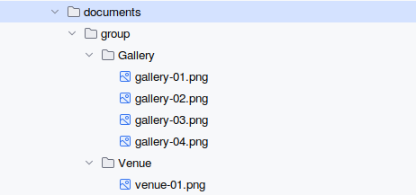
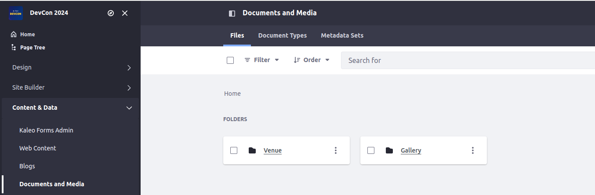
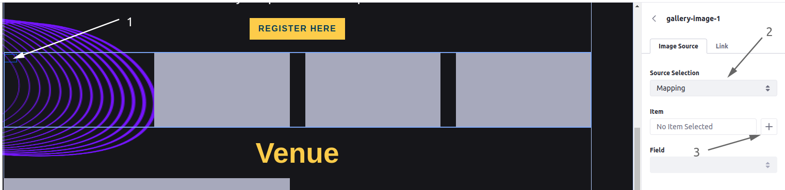
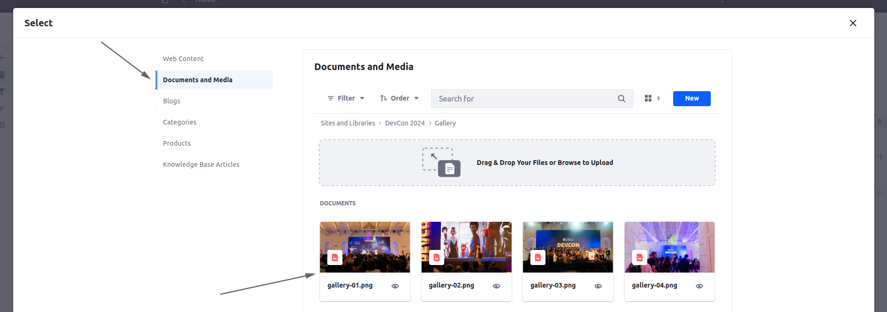
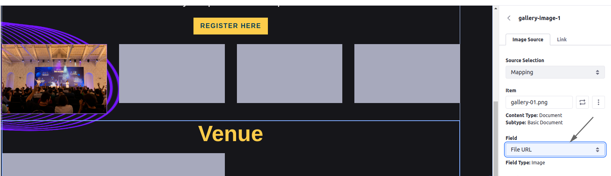
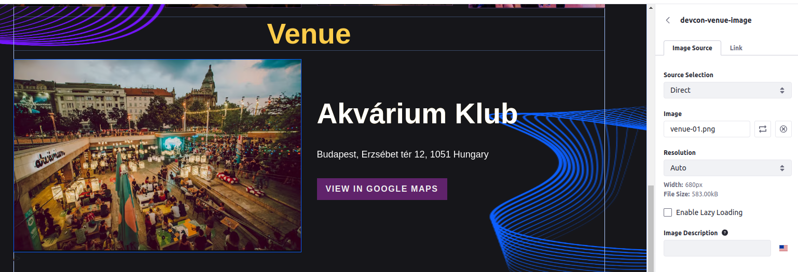
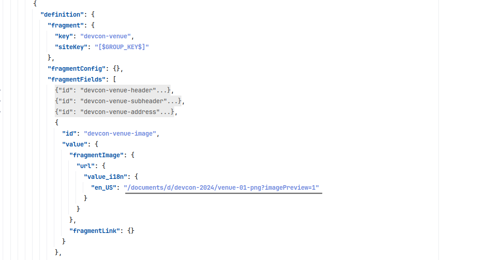

[Home](../../../README.md) / [Workshop](../README.md) 

# 14. Documents

## Goal 

Learn how you can define Documents & Media files in Site Initializer, content descriptors preparation with documents, using placeholders.  

## Context

The Gallery and Venue sections on Home page should display appropriate images.
Those images can be Document & Media documents, initialized with the Site Initializer, and used for the fragments. 

## Overview

Documents in Site Initializer are defined inside `documents` folder. Site-scoped documents should be stored inside the `group` subfolder, global documents - inside the `company` one.

Inside the `group`/`company` subfolder the documents and folders are defined.

Upon initialization the same folders/documents structure should be created in Documents & Media.

_Example in Liferay sources:_ https://github.com/liferay/liferay-portal/tree/master/modules/apps/site-initializer/site-initializer-masterclass/src/main/resources/site-initializer/documents/group

## Practice

### 1. Documents Definition

1.1. Copy [documents](../../../exercises/exercise-14/documents) folder from `exercise-14` to [site-initializer](../../../modules/devcon-site-initializer/src/main/resources/site-initializer):

1.2. Redeploy Site Initializer module and run Synchronize. 

1.3. Navigate to Content & Data → Document and Media. Make sure `Gallery` and `Venue` Folders created with appropriate files inside.

  

### 2. Additional Fragments Definition

2.1. Copy [devcon-gallery](../../../exercises/exercise-14/fragments/group/devcon/devcon-gallery) and [devcon-venue](../../../exercises/exercise-14/fragments/group/devcon/devcon-venue) fragments from `exercise-14` to [site-initializer](../../../modules/devcon-site-initializer/src/main/resources/site-initializer).

2.2. Redeploy Site Initializer module and run Synchronization. Make sure new fragments created.

### 3. Content Setup

3.1. Navigate to Site Builder → Pages and edit the Home page. 

3.2. Add `DevCon Gallery` and `DevCon Venue` fragments between `DevCon Home Page Banner` and `DevCon Ticket Prices`.

3.3. In the `DevCon Gallery` fragment for each editable image select an appropriate Documents & Media file using Mapping Source Selection and map to `File URL` field:

3.4. For the `DevCon Venue` fragment select the `venue-01.png` document using Direct Source Selection:

3.5. Publish the page.

### 4. Content Definition

4.1. Save the Fragment Composition for the wrapping container (see previous exercise for detail).

4.2. Export the fragment created from composition, and open the `fragment-composition-definition.json`.

4.2. Adjust the JSON file: remove auto-generated IDs, use `[$GROUP_KEY$]` / `[$GROUP_FRIENDLY_URL$]` placeholders for Site Key and Friendly URL.

4.3. Find sections with hard-coded `classPK` for `DevCon Gallery` fragment (which uses mapping source for documents):

Replace values for `classPK` with placeholder `[#DOCUMENT_FILE_ENTRY_ID:/file-path#]`, sample: 

`"[#DOCUMENT_FILE_ENTRY_ID:/site-initializer/documents/group/Gallery/gallery-01.png#]"`

4.4. Find a section with hard-coded URL for `DevCon Venue` fragment (which uses direct source for the document):

Replace URL value with placeholder `[$DOCUMENT_URL:/file-path$]`:

`[$DOCUMENT_URL:/site-initializer/documents/group/Venue/venue-01.png$]`

Note: you can use prepared [page-definition.json](../../../exercises/exercise-14/layouts/1_home/page-definition.json) file from `exercise-14`.

4.5. Update the `pageElements` root array in `page-definition.json` with a prepared JSON.

4.6. Redeploy Site Initializer module and run Synchronize. Make sure all content changes are in place. 

[<< 13. Page Content](../13-page-content/README.md) | [15. Web Content, Structures and Templates >>](../15-web-content/README.md)