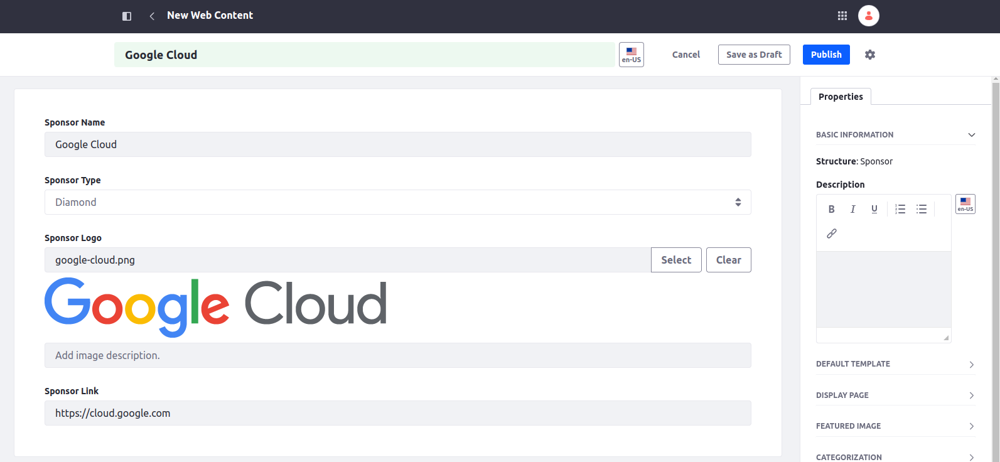

[Home](../../../README.md) / [Workshop](../README.md) 

# 15. Web Content, Structures and Templates

## Goal 

Learn how you can define Web Content Structures, Templates, Folders and Articles in Site Initializers.

## Context

In the context of this demo Web Content can be used for a Sponsors section on the Home page.

A Sponsor structure can be created with the following fields: sponsor name, sponsor type, sponsor logo and sponsor link. 

A list of Sponsor articles can be displayed in a Collection Display using field mapping on structure fields.  

## Overview

Using [Web Content](https://learn.liferay.com/w/dxp/content-authoring-and-management/web-content) you can define a data structure (Web Content Structure), template (Web Content Template), and individual content items of defined structure (Web Content Articles). 
Then you can use defined web content articles on site for displaying content - directly, or using fields mapping.

To define structured web content in Site Initializer you need to do the following steps:

**1. Define Web Content Structure**

Web Content Structure is defined in `[structure-name]-structure.xml` file inside `ddm-structures` folder.
In the descriptor file you need to specify the structure name and structure definition JSON:

```xml
<?xml version="1.0"?>
<root>
    <structure>
        <name>Structure Name</name>
        <description></description>
        <definition>
            <![CDATA[
                // Structure Definition JSON
            ]]>
        </definition>
    </structure>
</root>
```

**2. Define Web Content Template**

Web Content Templates are defined in `ddm-templates` folder. For each template a subfolder is created with the following files:
- `ddm-template.ftl` - the template file with Freemarker code for the template;
- `ddm-template.json` - the template descriptor, where you can specify the template name and key, and also the structure key, sample:
```json 
{
   "ddmStructureKey": "SPONSOR",
   "ddmTemplateKey": "SPONSOR",
   "name": "Sponsor"
}
```

**3. Define Web Content Folder and Articles**

Web Contents are defined inside `journal-articles` folder. 

Web Content Folder is defined in `[folder-name].metadata.json` file inside the `journal-articles` folder, sample:
```json
{
   "description": "Sponsors Journal Folder",
   "externalReferenceCode": "SPONSORSJOURNALFOLDER",
   "name": "Sponsors",
   "viewableBy": "Anyone"
}
```

For each Web Content Folder a subfolder inside `journal-articles` should be created. Web Content Articles are defined inside the subfolder using a pair of files:
- `<web-content>.json` - the web content descriptor, sample:
```json
{
  "articleId": "GOOGLE-CLOUD",
  "assetCategoryERCs": [
  ],
  "ddmStructureKey": "SPONSOR",
  "ddmTemplateKey": "SPONSOR",
  "folder": "Sponsors",
  "name": "Google Cloud"
}
```
- `<web-content>.xml` - the web content definition XML.

## Practice

To define content descriptors for web content structures, templates and articles you can create them on portal and then export data for content descriptors. 

### 1. Structure Creation

1.1. Navigate to Content & Data → Web Content → Structures. Click `New` button to add a new Structure:


1.2. Specify the Name (`Sponsor`) and define the following fields:

|             Type |        Label | Field Reference |                                                          Options |
|-----------------:|-------------:|-----------------|-----------------------------------------------------------------:|
|             Text | Sponsor Name | sponsorName     |                                                                  |
| Select from List | Sponsor Type | sponsorType     | Diamond(diamond), Platinum(platinum), Gold(gold), Silver(silver) | 
|            Image | Sponsor Logo | sponsorLogo     |                                                                  |
|             Text | Sponsor Link | sponsorLink     |                                                                  |


Save the structure.

### 2. Structure Definition

2.1. Create a `ddm-structures` folder inside `site-initializer`, and create a `sponsor-structure.xml` XML file with the following structure:
```xml
<?xml version="1.0"?>
<root>
   <structure>
      <name>Sponsor</name>
      <description></description>
      <definition>
         <![CDATA[
         ]]>
      </definition>
   </structure>
</root>
```

2.1. Copy the structure definition JSON from the database (`DDMStructure.definition`) to the `definition` tag, inside the `CDATA` section.

_**Note**: Web Content Structures have `Export as JSON` action, but the exported file format is not compatible with Site Initializer._
_You can get a compatible JSON directly from a Database, from the `definition` column of the `DDMStructure` table._


2.3. Adjust auto-generated `name` attributes to have the same values as `fieldReference`. Also, adjust `value` attributes for options to have the same values as `reference`:


2.4. Delete the manually created structure.

2.5. Redeploy Site Initializer and run Synchronize. Make sure Structure created as expected. 

_**Note**: use can use [sponsor-structure.xml](../../../exercises/exercise-15/ddm-structures/sponsor-structure.xml) file from `exercise-15`._

### 2. Template Definition

2.1. Copy [ddm-templates/sponsor](../../../exercises/exercise-15/ddm-templates/sponsor) directory from `exercise-15` to Site Initializer.

2.2. Check `ddm-template.ftl` and `ddm-template.json` files.

2.3. Redeploy Site Initializer and run Synchronize.

2.4. Navigate to Content & Data → Web Content → Templates. Make sure `Sponsor` template is created:


### 3. Journal Folder Definition

3.1. Create `journal-articles` directory under [site-initializer](../../../modules/devcon-site-initializer/src/main/resources/site-initializer)`.

3.2. Copy [sponsors.metadata.json](../../../exercises/exercise-15/journal-articles/sponsors.metadata.json) file to `journal-articles` directory:

```json
{
	"description": "Sponsors Journal Folder",
	"externalReferenceCode": "SPONSORSJOURNALFOLDER",
	"name": "Sponsors",
	"viewableBy": "Anyone"
}
```
3.3. Create `sponsors` directory inside `journal-articles`. Put a dummy file inside (e.g. `.gitkeep`) to make it not skipped by Site Initializer.


3.4. Redeploy Site Initializer and run Synchronize.  Navigate to Content & Data → Web Content. Make sure `Sponsors` Journal folder created:


### 4. Articles Definition

4.1. Copy [documents/group/Sponsors](../../../exercises/exercise-15/documents/group/Sponsors) folder from `exercise-15` to `site-initializer/documents/group` folder in Site Initializer module (to define logos for sponsors). 

4.2. Redeploy Site Initializer and run Synchronize. Make sure Sponsors DL Folder is created:


4.3. Navigate to Content & Data → Web Content → `Sponsors` Journal Folder.

4.4. Create a new `Sponsor` Web Content:


Fill Sponsor information (e.g. for Google Cloud), and publish a web content:



_**Note**: select a `Sponsor Logo` image form the files uploaded in 4.1._

4.5. To obtain the web content definition navigate to the web content and click on ⋮ → View Source:


Copy the XML source displayed:


4.6. Create `google-cloud.xml` web content definition file inside `sponsors` directory, and paste the XML copied above.

4.6. Adjust the XML to clean up environment-specific data.

For the `sponsorLogo` field there is the following JSON definition inside exported XML (for referencing a document from Documents & Media):  


This JSON needs to be replaced with a document placeholder using `<![CDATA[[$DOCUMENT_JSON:/path-to-document$]]]>` pattern, sample:

`<![CDATA[[$DOCUMENT_JSON:/site-initializer/documents/group/Sponsors/google-cloud.png$]]]>`

4.7. Create `google-cloud.json` web content descriptor file:

```json
{
	"articleId": "GOOGLE-CLOUD",
	"assetCategoryERCs": [
	],
	"ddmStructureKey": "SPONSOR",
	"ddmTemplateKey": "SPONSOR",
	"folder": "Sponsors",
	"name": "Google Cloud"
}
```

4.8. Repeat steps 4.4. - 4.7. for other Sponsor web contents.

_**Note**: you can also copy already prepared files from [sponsors](../../../exercises/exercise-15/journal-articles/sponsors) folder in `exercise-15`._

4.9. Redeploy Site Initializer and Run Synchronize. Make sure Web Contents are created:


_**Note**: delete manually created Web Contents before synchronization to avoid duplicated content._

## References

_Examples in Liferay sources:_
- Structure: https://github.com/liferay/liferay-portal/blob/master/modules/apps/site-initializer/site-initializer-masterclass/src/main/resources/site-initializer/ddm-structures/blog-structure.xml
- Template: https://github.com/liferay/liferay-portal/tree/master/modules/apps/site-initializer/site-initializer-masterclass/src/main/resources/site-initializer/ddm-templates/blog-entry
- Folder: https://github.com/liferay/liferay-portal/blob/master/modules/apps/site-initializer/site-initializer-masterclass/src/main/resources/site-initializer/journal-articles/blog-entries.metadata.json
- Articles: https://github.com/liferay/liferay-portal/tree/master/modules/apps/site-initializer/site-initializer-masterclass/src/main/resources/site-initializer/journal-articles/blog-entries


[<< 14. Documents](../14-documents/README.md) | [16. Collections >>](../16-collections/README.md)

###### © [Vitaliy Koshelenko](https://www.linkedin.com/in/vitaliy-koshelenko) 2024 | All rights reserved