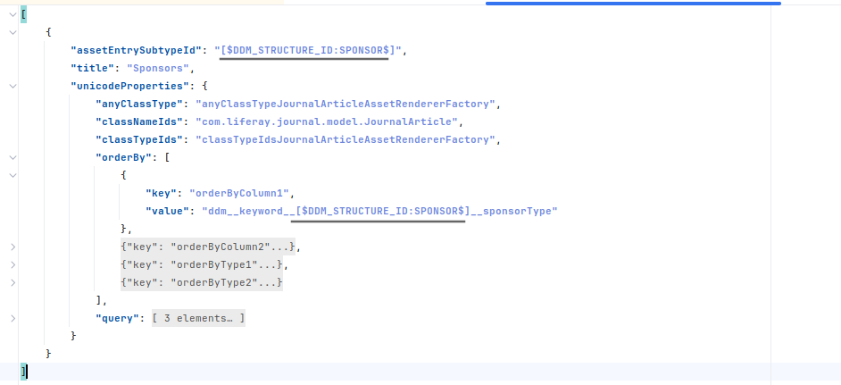
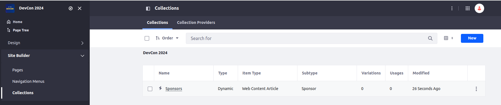

[Home](../../../README.md) / [Workshop](../README.md) 

# 16. Collections

## Goal 

Learn how you can define Collections in Site Initializers, hands-on experience on page definitions having Collection Display elements.

## Context

A list of Sponsors on the Home page can be displayed as a Collection of structured web contents using fragment fields mapping on structure fields.

## Overview

[Collection](https://learn.liferay.com/w/dxp/site-building/displaying-content/collections-and-collection-pages) is a set of content items that can be used for filtering and displaying information. 
You can create a collection of entities (e.g. Web Contents of a given Structure) and then display it in a Collection Display fragment.

Collections in Site Initializer are defined in `asset-list-entries.json` descriptor file. 
The descriptor file may contain multiple collections. 
For each of them a `title`, `assetEntrySubtypeId` (DDM Structure ID for Web Contents), and `unicodeProperties` (asset query details) are defined.

_Example in Liferay sources: https://github.com/liferay/liferay-portal/blob/master/modules/apps/site-initializer/site-initializer-masterclass/src/main/resources/site-initializer/asset-list-entries.json_

## Practice

### 1. Collection Definition

1.1. Copy [asset-list-entries.json](../../../exercises/exercise-16/asset-list-entries.json) file from `exercise-16` to [site-initializer](../../../modules/devcon-site-initializer/src/main/resources/site-initializer).

1.2. Analyze the JSON definition.

_**Note**: here a `[$DDM_STRUCTURE_ID:<STRUCTURE_ID>$]` placeholder is used to get `ddmStructureId` by `ddmStructureKey`: for `assetEntrySubtypeId`, and also in `orderBy` section (to sort articles by `sponsorType` structure field)._

1.3. Redeploy Site Initializer and Run Synchronize.

1.4. Navigate to Site Builder → Collections. Make sure `Sponsors` collection is created:

[<< 15. Web Content, Structures and Templates](../15-web-content/README.md) | [17. Objects >>](../17-objects/README.md)