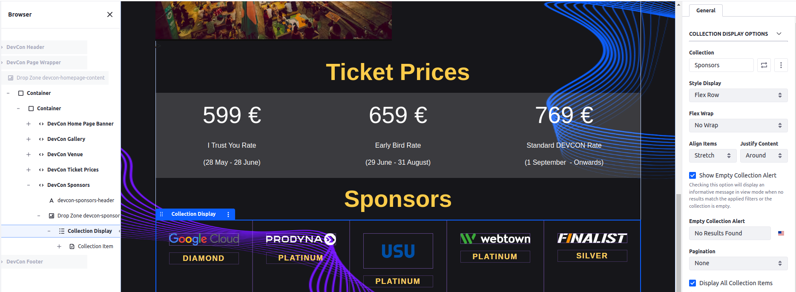
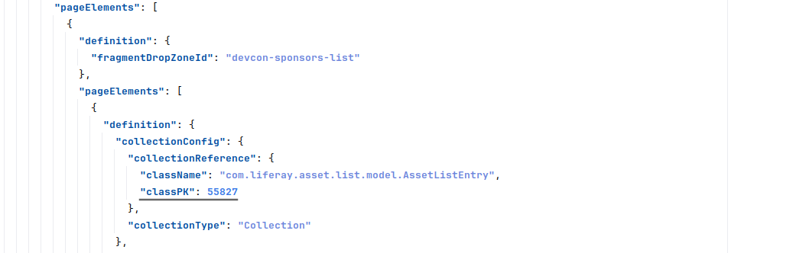
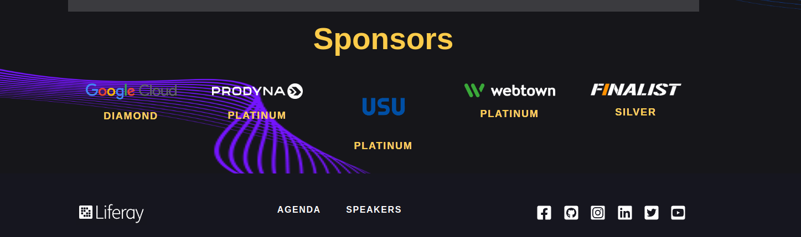

[Home](../../../README.md) / [Workshop](../README.md) 

# 16. Collections

## Goal 

Learn how you can define Collections in Site Initializers, hands-on experience on page definitions having Collection Display elements.

## Context

A list of Sponsors on the Home page can be displayed as a Collection of structured web contents using fragment fields mapping on structure fields.

## Overview

[Collection](https://learn.liferay.com/w/dxp/site-building/displaying-content/collections-and-collection-pages) is a set of content items that can be used for filtering and displaying information. 
You can create a collection of entities (e.g. Web Contents of a given Structure) and then display it in a Collection Display fragment.

Collections in Site Initializer are defined in `asset-list-entries.json` descriptor file. 
The descriptor file may contain multiple collections. 
For each of them a `title`, `assetEntrySubtypeId` (DDM Structure ID for Web Contents), and `unicodeProperties` (asset query details) are defined.

_Example in Liferay sources: https://github.com/liferay/liferay-portal/blob/master/modules/apps/site-initializer/site-initializer-masterclass/src/main/resources/site-initializer/asset-list-entries.json_

## Practice

### 1. Collection Definition

1.1. Copy [asset-list-entries.json](../../../exercises/exercise-16/asset-list-entries.json) file from `exercise-16` to [site-initializer](../../../modules/devcon-site-initializer/src/main/resources/site-initializer).

1.2. Analyze the JSON definition.

_**Note**: here a `[$DDM_STRUCTURE_ID:<STRUCTURE_ID>$]` placeholder is used to get `ddmStructureId` by `ddmStructureKey`: for `assetEntrySubtypeId`, and also in `orderBy` section (to sort articles by `sponsorType` structure field)._

1.3. Redeploy Site Initializer and Run Synchronize.

1.4. Navigate to Site Builder → Collections. Make sure `Sponsors` collection is created:

### 2. Additional Fragments Definition

2.1. Copy [devcon-sponsors](../../../exercises/exercise-16/fragments/group/devcon/devcon-sponsors) and [devcon-sponsor-icon](../../../exercises/exercise-16/fragments/group/devcon/devcon-sponsor-icon) fragments from `exercise-16` to [site-initializer](../../../modules/devcon-site-initializer/src/main/resources/site-initializer).

2.2. Redeploy Site Initializer module and run Synchronization. Make sure new fragments created.

### 3. Collection Display Setup

3.1. Navigate to Site Builder → Pages and edit the Home page.

3.2. Add a `DevCon Sponsors` fragment below the `DevCon Ticket Prices`.

3.3. Add a Collection Display to the fragment’s DropZone.

3.4. Configure Collection Display to use `Sponsors` collection.

3.5. Add a `DevCon Sponsor Icon` fragment inside the Collection Element.

3.6. Map fragment fields in the following way:

| Editable Field |          Tab | Source     |        Field | Open in a new tab. |
|---------------:|-------------:|------------|-------------:|-------------------:|
|  sponsor-image | Image Source | Mapping    | Sponsor Logo |                    |
|  sponsor-image |         Link | Mapped URL | Sponsor Link |               true |
|  sponsor-level |      Mapping |            | Sponsor Type |                    |
|  sponsor-level |         Link | Mapped URL | Sponsor Link |               true |

3.7. Define the following Collection configuration:

|         Configuration Option |    Value |
|-----------------------------:|---------:|
|                Style Display | Flex Row |
|                    Flex Wrap |  No Wrap |
|                  Align Items |  Stretch |
|              Justify Content |   Around |
|                   Pagination |     None |
| Display All Collection Items |     true |

3.8. Publish the page.

### 4. Page Definition Updates

4.1. Save the Fragment Composition for the wrapper container, export fragment and open the `fragment-composition-definition.json` file inside the exported ZIP.

4.2. In the exported JSON find a section that corresponds to the `devcon-sponsors-list` fragment. 
In the collection configuration you can find a hard-coded ID for the `AssetListEntry`:

Replace it with a `ASSET_LIST_ENTRY_ID` placeholder in format `[#ASSET_LIST_ENTRY_ID:<COLLECTION-KEY>#]`, sample: `[#ASSET_LIST_ENTRY_ID:SPONSORS#]`.

4.3. Update `page-definition.json` for the Home page using the exported JSON.

_**Note**: you can use prepared [page-definition.json](../../../exercises/exercise-16/layouts/1_home/page-definition.json) file from `exercise-16`._ 

4.4. Redeploy Site Initializer and Run Synchronize. Make sure Sponsors section on the Home page is displayed properly.

[<< 15. Web Content, Structures and Templates](../15-web-content/README.md) | [17. Objects >>](../17-objects/README.md)

###### © Vitaliy Koshelenko 2024 | All rights reserved