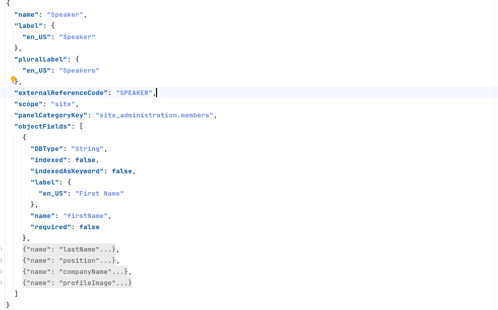
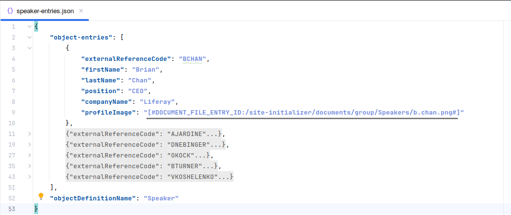
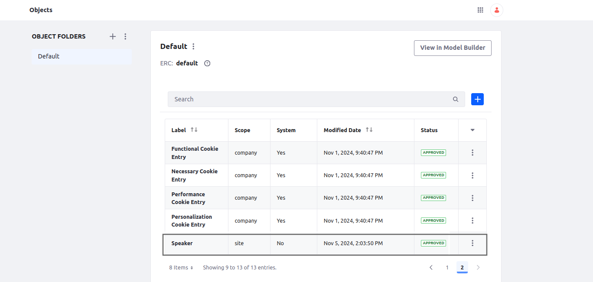
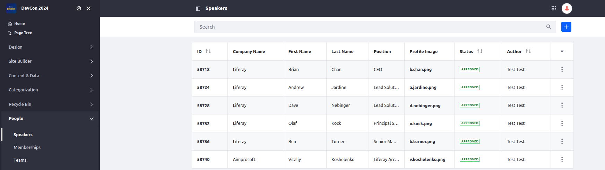
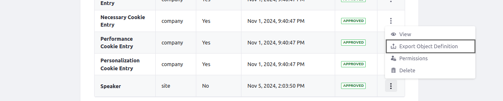
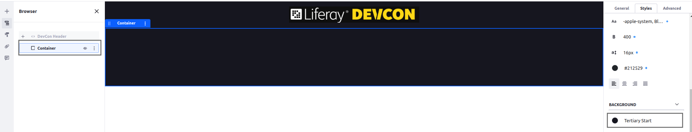
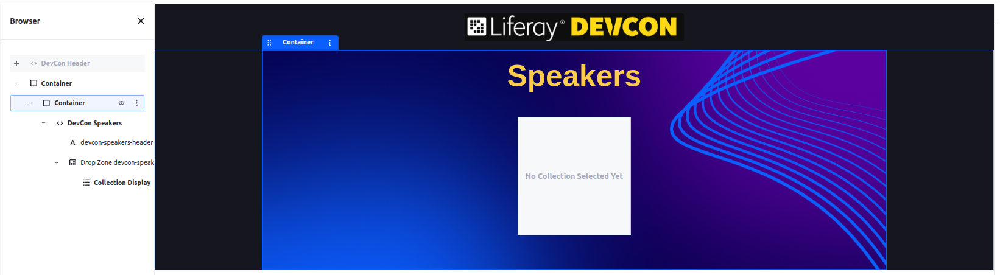
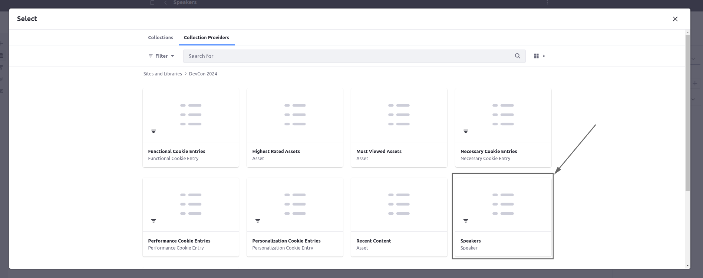
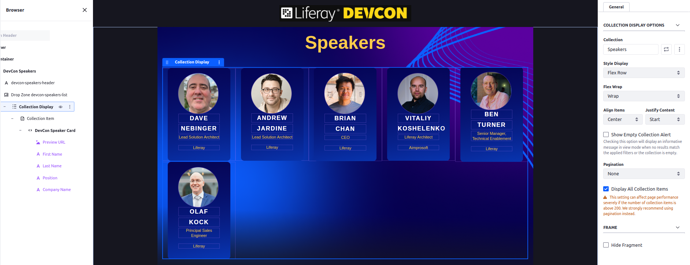

[Home](../../../README.md) / [Workshop](../README.md) 

# 17. Objects

## Goal 

Learn how you can define Objects and Object Entries in Site Initializer. Experience in displaying Objects in a Collection Display, and defining such content descriptors for Site Initializers.   

## Context

In the context of this demo Objects can be used to display a list of speakers on the Speaker page.
A Speaker Object can be defined, and a list of Object entries can be created and displayed in a Collection Display.

## Overview

[Objects](https://learn.liferay.com/w/dxp/liferay-development/objects) are used to speed up development process using no-code/low-code capabilities. 
Using Objects you can define data structures and entities, and use them in various Liferay applications and frameworks: Collection Displays and Forms, Permissions and Workflow, etc.

Object information in the Site Initializer can be defined with the following descriptors:

|          Data Type | Site Initializer Folder | Recommended File Name Pattern       | Example in Liferay                                                                                                                                                                                                                                               |
|-------------------:|------------------------:|-------------------------------------|------------------------------------------------------------------------------------------------------------------------------------------------------------------------------------------------------------------------------------------------------------------|
| Object Definitions |      object-definitions | `<object-name>.json`                | [testray-build.json](https://github.com/liferay/liferay-portal/blob/master/workspaces/liferay-testray-workspace/client-extensions/liferay-testray-site-initializer/site-initializer/object-definitions/testray-build.json)                                       |
|     Object Entries |          object-entries | `<object-name>-entries.json`        | [1_testray-case-type.object-entries.json](https://github.com/liferay/liferay-portal/blob/master/workspaces/liferay-testray-workspace/client-extensions/liferay-testray-site-initializer/site-initializer/object-entries/1_testray-case-type.object-entries.json) |
|      Object Fields |           object-fields | `<object-name>-fields.json`         | [testray-build-to-tasks.json](https://github.com/liferay/liferay-portal/tree/master/workspaces/liferay-testray-workspace/client-extensions/liferay-testray-site-initializer/site-initializer/object-relationships)                                               |
|   Object Relations |    object-relationships | `<object-one>-to-<object-two>.json` | [build-case-results-object-fields.json](https://github.com/liferay/liferay-portal/blob/master/workspaces/liferay-testray-workspace/client-extensions/liferay-testray-site-initializer/site-initializer/object-fields/build-case-results-object-fields.json)      |

## Practice

### 1. Define Additional Fragments and Documents.

1.1. Copy [devcon-speakers](../../../exercises/exercise-17/fragments/group/devcon/devcon-speakers) and [devcon-speaker-card](../../../exercises/exercise-17/fragments/group/devcon/devcon-speaker-card) fragments from `exercise-17` to [site-initializer](../../../modules/devcon-site-initializer/src/main/resources/site-initializer) (`site-initializer/fragments/group/devcon` folder).

1.2. Copy [Speakers](../../../exercises/exercise-17/documents/group/Speakers) folder from `exercise-17` to [site-initializer](../../../modules/devcon-site-initializer/src/main/resources/site-initializer) (`site-initializer/documents/group` folder).

1.3. Redeploy Site Initializer and run Synchronize. Make sure new fragments and documents created.


### 2. Define Object and Object Entries

2.1. Copy [object-entries](../../../exercises/exercise-17/object-entries) folder from `exercise-17` to [site-initializer](../../../modules/devcon-site-initializer/src/main/resources/site-initializer).

Check the Object definition in a `speaker-entries.json` descriptor file:


_**Note**: here a Speakers Object is defined with fields: firstName, lastName, position, companyName, profileImage._

2.2. Copy [object-entries](../../../exercises/exercise-17/object-entries) folder from `exercise-17` to [site-initializer](../../../modules/devcon-site-initializer/src/main/resources/site-initializer).

Check Object Entries definition in a `speaker-entries.json` descriptor file:


_**Note**: For `profileImage` field a Documents & Media document is referenced using `DOCUMENT_FILE_ENTRY_ID` placeholder._

2.3. Redeploy Site Initializer and run Synchronize.

2.4. Navigate to Control Panel → Objects. Make sure `Speaker` Object is created:



2.5. Navigate to Site Builder → People → Speakers (a new menu item should be generated). Make sure `Speakers` entries are created:



_**Note**: You can export existing Object definition from the Objects list using ⋮ → Export Object Definition menu, and then integrate it to Site Initializer._



[<< 16. Collections](../16-collections/README.md)


### 3. Displaying Objects

3.1. Navigate to Site Builder → Pages and edit the Speakers page.

3.2. Add a wrapping container with Min Height=100VH and `Teriary Start` background color:



3.3. Add an inner Fixed Width Container. Add the `DevCon Speakers` fragment into the inner Container. Add a Collection Display to a fragment’s DropZone:



3.4. Select the Speakers collection on the Collection Providers tab:



3.5. Add a `DevCon Speaker Card` fragment to the Collection Item, and configure field mapping in the following way:

| Editable Field            | Object Field  |
|---------------------------|---------------|
| devcon-speaker-logo       | Preview URL   |
| devcon-speaker-first-name | First Name    |
| devcon-speaker-last-name  | Last Name     |
| devcon-speaker-position   | Position      |
| devcon-speaker-company    | Company Name  |

3.6. Define the following configuration for the Collection Display:

| Configuration                  | Value    |
|--------------------------------|----------|
| Style Display                  | Flex Row |
| Flex Wrap                      | Wrap     |
| Align Items                    | Center   |
| Justify Content                | Start    |
| Pagination                     | None     |
| Display All Collection Items   | true     |



Publish the page.

### 4. Page Definition 

**4.1. Save Fragment Composition.**

Save Fragment Composition for a wrapping container, and export the fragment. 
Open the `fragment-composition-definition.json` file inside the exported ZIP file.

**4.2. Cleanup JSON** 

Cleanup JSON from environment-specific data:
- Remove generated `id` elements, e.g. `"id": "a9bb2e5d-0be7-6030-f1fa-6c65277f13e9"`;
- Use `[$GROUP_KEY$]` placeholder for `siteKey`: replace `"siteKey": "DevCon 2024"` with `"siteKey": "[$GROUP_KEY$]"`
- Find collection provider definition and replace hard-coded companyId (`91078559743509` below) with `[$COMPANY_ID$]` placeholder:
```
"collectionConfig": {
                      "collectionReference": {
                        "className": "com.liferay.object.web.internal.info.collection.provider.ObjectEntrySingleFormVariationInfoCollectionProvider_91078559743509_C_Speaker"
                      },
                      "collectionType": "CollectionProvider"
                    },
```

**4.3. Update Page Definition**

Update `page-definition.json` file for Speakers page using the JSON above: put the JSON inside the root `pageElements` array.

Redeploy Site Initializer module and run Synchronize. Make sure everything is displayed properly:


### 5. Customization

Todo